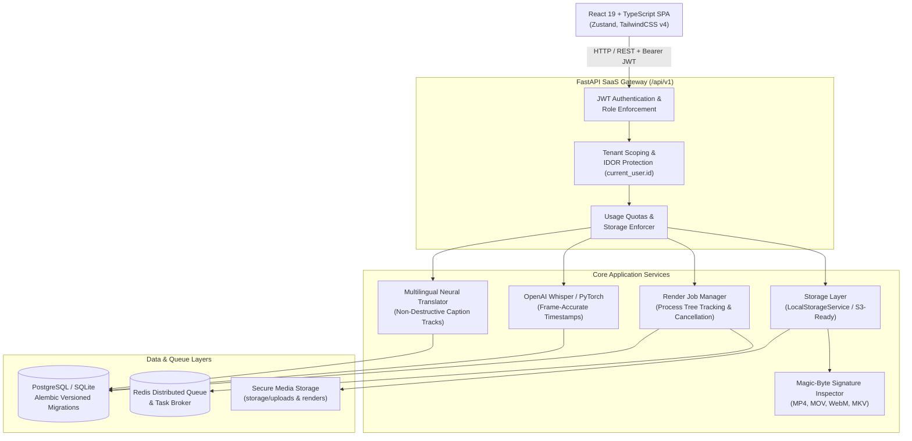

# 🚀 CaptionStudio — Enterprise AI Captioning & Video Engine SaaS

[](https://github.com/Muhammad5231/CaptionStudio02/actions)
[](https://fastapi.tiangolo.com)
[](https://react.dev)
[](https://tailwindcss.com)
[](https://www.postgresql.org)
[](https://ffmpeg.org)

> **CaptionStudio** is an enterprise-grade AI video captioning SaaS platform designed for content creators, marketing agencies, and media teams. It pairs a **streamlined, distraction-free browser editor** with an **industrial FFmpeg & Whisper rendering backend**, providing pixel-perfect word animations, multilingual subtitle tracks, and multi-tenant security.

---

## 🏛 System Architecture



---

## ✨ Enterprise SaaS Capabilities

### 1. Multi-User Authentication & Security
- **JWT Authentication & Passwords**: Signed Bearer tokens using PyJWT and industry-standard `bcrypt` password hashing.
- **Strict IDOR Protection**: All project operations (fetch, update, duplicate, delete, upload, render) are strictly isolated to `current_user.id`.
- **Role-Based Access Control (RBAC)**: Distinct permissions for `user` and `admin` roles.
- **Seeded Admin Account**: Ready out-of-the-box (`admin@captionstudio.com` / `Admin12345!`).

### 2. Relational Schema & Alembic Migrations
- **Models Supported**: `UserModel`, `ProjectModel`, `MediaAssetModel`, `CaptionTrackModel`, `ExportJobModel`, `UsageRecordModel`, `SubscriptionModel`, `AdminAuditLogModel`.
- **Zero Data Loss Upgrades**: Version-controlled migrations using Alembic (`001_initial_saas_schema.py`) with automatic SQLite column synchronization.
- **PostgreSQL & SQLite Dual Support**: Full connection pooling for PostgreSQL in production and zero-config SQLite for local development.

### 3. Non-Destructive Multilingual Caption Tracks
- **Track Isolation**: Translating video captions into another language (Spanish, French, German, Japanese, etc.) creates an isolated, named `CaptionTrackModel` rather than overwriting original transcription.
- **Live Track Switching**: Instant toggle between languages in both editor canvas and export selector.

### 4. Resilient Background Job Queue & Cancellation
- **Job Cancellation**: User or admin can cancel in-flight exports; the system terminates the FFmpeg process tree immediately (Windows `taskkill /T /F` and Linux `os.killpg`).
- **Distributed Queue**: Pluggable Redis-backed queue with fallback to asynchronous memory queue for zero-dependency setups.
- **Export Progress Tracking**: Live progress reporting (`0%` → `100%`) with stages (`preparing`, `generating_ass`, `rendering`, `finalizing`).

### 5. Abstract Storage Layer with Magic-Byte Inspection
- **Storage Abstraction**: `StorageService` interface with `LocalStorageService` implemented and AWS S3 architecture ready.
- **Security Validation**: Validates file magic-bytes (`ftypisom`, `webm`, `riff`) to stop spoofed file extensions.
- **Path Traversal Protection**: Enforces sanitized paths outside target directories.

### 6. Admin Governance & Diagnostics Dashboard
- **Admin Overview**: High-level telemetry for total users, active accounts, total renders, failed renders, and storage footprint.
- **User Governance**: Search and toggle active/inactive status across all tenant accounts.
- **Queue Management**: Monitor rendering queue, inspect failure logs, and re-trigger jobs with 1-click.
- **System Health Diagnostics**: Live API, Database, and Storage health checks.

### 7. Authoritative Browser Editor
- **Viral Style Presets**: Hormozi, Pop, Viral, Neon, Minimal, Cinematic, and Chroma Key.
- **Chroma Key (Green Screen) Mode**: Render captions over green screen (`#00FF00`) for seamless Premiere Pro / DaVinci Resolve overlay.
- **60 FPS Preview**: Ultra-responsive canvas playback with word animations.
- **Direct MP4 Downloads**: In-memory blob streaming with fallback static links.

---

## 🛠 Tech Stack

| Layer | Technologies |
|---|---|
| **Frontend** | React 19, TypeScript, Vite 8, Tailwind CSS v4, Zustand 5, Lucide Icons |
| **Backend** | Python 3.11+, FastAPI, Pydantic v2, PyJWT, Bcrypt, Alembic, SQLAlchemy 2.0 |
| **Media & AI** | OpenAI Whisper, PyTorch, FFmpeg 7.1, libass, deep-translator |
| **Databases** | PostgreSQL 16 / SQLite 3, Redis 7 |
| **DevOps** | Docker, Docker Compose, GitHub Actions CI |

---

## 🔌 API Reference (`/api/v1`)

### Authentication (`/api/v1/auth`)
| Method | Endpoint | Description |
|---|---|---|
| `POST` | `/api/v1/auth/register` | Register new user account |
| `POST` | `/api/v1/auth/login` | Authenticate with email/password and receive JWT |
| `GET` | `/api/v1/auth/me` | Fetch authenticated user profile and subscription |
| `POST` | `/api/v1/auth/change-password` | Update account password |

### Projects & Media (`/api/v1/projects`)
| Method | Endpoint | Description |
|---|---|---|
| `GET` | `/api/v1/projects` | List all projects belonging to `current_user` |
| `POST` | `/api/v1/projects` | Create a new project |
| `GET` | `/api/v1/projects/{id}` | Get project details (IDOR scoped) |
| `PUT` | `/api/v1/projects/{id}` | Update project metadata, style, or captions |
| `POST` | `/api/v1/projects/{id}/duplicate` | Safely clone project and underlying media |
| `DELETE` | `/api/v1/projects/{id}` | Delete project |
| `POST` | `/api/v1/projects/{id}/upload` | Upload media with magic-byte check |
| `POST` | `/api/v1/projects/{id}/transcribe` | Run OpenAI Whisper speech-to-text |
| `POST` | `/api/v1/projects/{id}/translate` | Translate captions and create non-destructive track |
| `GET` | `/api/v1/projects/{id}/tracks` | List all caption tracks for project |
| `POST` | `/api/v1/projects/{id}/tracks/{track_id}/activate` | Switch active caption track |

### Export & Renders (`/api/v1/export` & `/api/v1/jobs`)
| Method | Endpoint | Description |
|---|---|---|
| `POST` | `/api/v1/projects/{id}/export` | Trigger 1080p FFmpeg burn-in render |
| `GET` | `/api/v1/jobs/{job_id}` | Poll export progress and download URL |
| `POST` | `/api/v1/jobs/{job_id}/cancel` | Cancel in-flight render and kill process tree |

### Administration (`/api/v1/admin`)
| Method | Endpoint | Description |
|---|---|---|
| `GET` | `/api/v1/admin/overview` | Telemetry KPIs (users, projects, renders, storage) |
| `GET` | `/api/v1/admin/users` | List all tenant accounts |
| `PATCH` | `/api/v1/admin/users/{id}/status` | Activate or suspend user |
| `GET` | `/api/v1/admin/jobs` | Monitor rendering queue |
| `POST` | `/api/v1/admin/jobs/{id}/retry` | Re-queue failed render |
| `GET` | `/api/v1/admin/health` | Service and database health |

---

## 🚀 Quick Start Guide

### Option A: Running with Docker Compose (Recommended for Production)

```bash
# 1. Clone repository
git clone https://github.com/Muhammad5231/CaptionStudio02.git
cd CaptionStudio02

# 2. Copy and customize environment variables
cp .env.example .env

# 3. Spin up application, PostgreSQL, and Redis
docker compose up --build -d

# 4. Open in browser
# App is live at: http://localhost:8000
# Initial Admin: admin@captionstudio.com / Admin12345!
```

---

### Option B: Local Development Setup

#### 1. Prerequisites
- Python 3.11+
- Node.js 20+
- FFmpeg 6+ or 7+ (added to system PATH)

#### 2. Backend Setup
```bash
cd backend

# Create virtual environment (optional)
python -m venv venv
# Windows:
venv\Scripts\activate
# Linux/macOS:
# source venv/bin/activate

# Install dependencies
pip install -r requirements.txt

# Run database migrations
python -m alembic upgrade head

# Start FastAPI server
python -m uvicorn app.main:app --host 127.0.0.1 --port 8000 --reload
```

#### 3. Frontend Setup
In a new terminal:
```bash
cd frontend

# Install packages
npm install

# Start Vite development server
npm run dev
```

Open **`http://localhost:5173`** in your browser.

---

## 🧪 Testing & Quality Assurance

### Run Backend Pytest Suite
```bash
pytest backend/tests/ -v
```
*Current test suite: **17 passed** covering authentication, IDOR scoping, admin controls, multilingual tracks, usage summaries, FFmpeg export cancellation, and subtitle parsers.*

### Run Frontend Typecheck & Build
```bash
cd frontend
npm run build
```

---

## 📄 License
MIT License. Created and maintained for modern creators and engineering teams.
